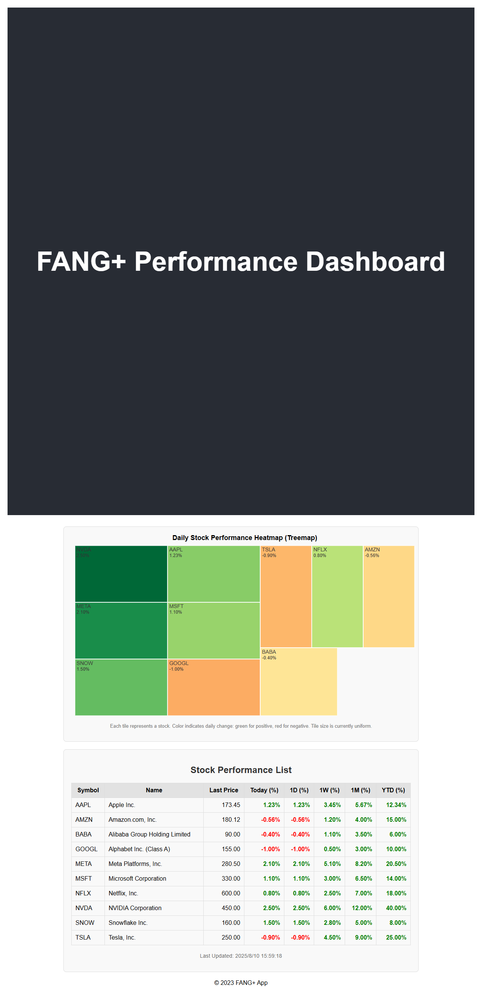

# FANG+ パフォーマンス可視化アプリ

## プロジェクト概要

本プロジェクトは、FANG+（Facebook / Meta, Apple, Amazon, Netflix, Google / Alphabet などの大型テクノロジー企業）構成銘柄の株価パフォーマンスを、リアルタイムに近い形で可視化するウェブアプリケーションです。ユーザーは、当日・日次・週次・月次・年初来（YTD）の株価変動率を直感的に確認できます。

---

**アプリのイメージ**


<!-- ↑画像ファイルを用意し、パスを適宜修正してください -->

---

### デプロイ先

現在、アプリのフロントエンドのみがFirebase Hostingにデプロイされています。  
**公開URL:** [https://fang-plus-app.firebaseapp.com/](https://fang-plus-app.firebaseapp.com/)

#### 現状のデプロイ状況とそのデメリット

- **フロントエンドのみがデプロイされており、バックエンド（Cloud Functions）は未デプロイです。**
    - Firestoreのデータはローカルや手動で投入したもののみが参照されます。
    - 株価データの自動更新やAPI連携は動作しません（データが古いままになる可能性があります）。
    - 本来の「リアルタイム更新」や「自動データ取得」機能は利用できません。
    - データ更新を行いたい場合は、ローカルでCloud Functionsを手動実行する必要があります。
- **デプロイの理由**
    - Firebase Sparkプランでは外部依存関係を持つCloud Functionsのデプロイが制限されているため、フロントエンドのみの公開となっています。
    - 本番運用や自動更新を有効化するには、Firebase BlazeプランへのアップグレードとCloud Functionsのデプロイが必要です。

---

## 主な機能

*   **ヒートマップ表示**: 当日の株価変動率を銘柄ごとに色分け表示（プラスは緑系、マイナスは赤系）。タイル形式で相対的なパフォーマンスを視覚化します。
*   **パフォーマンスリスト表示**: 日次・週次・月次・YTDの変動率を表形式で表示。
*   **データ自動更新**: バックエンドのCloud Functionsが外部株価API (Alpha Vantage) から定期的にデータを取得し、Cloud Firestoreへ保存します。
*   **リアルタイム同期**: Firestoreのリアルタイムリスニング機能を利用し、フロントエンドにデータが即時反映されます。
*   **レスポンシブ対応**: スマートフォン、タブレット、PCなど、様々なデバイスで表示できるように最適化されています。

## 技術スタック

| 層         | 技術                                |
| :--------- | :---------------------------------- |
| バックエンド | Firebase Cloud Functions (Node.js)  |
| データベース | Firebase Cloud Firestore            |
| ホスティング | Firebase Hosting                    |
| フロントエンド | React.js + TypeScript + D3.js       |
| 外部API    | Alpha Vantage (株価データ取得用)    |

## データ構造と更新頻度

### Firestore データ構造

`stocks` というコレクションに各銘柄のドキュメントが保存されます。

## 技術スタック

| 層         | 技術                                |
| :--------- | :---------------------------------- |
| バックエンド | Firebase Cloud Functions (Node.js)  |
| データベース | Firebase Cloud Firestore            |
| ホスティング | Firebase Hosting                    |
| フロントエンド | React.js + TypeScript + D3.js       |
| 外部API    | Alpha Vantage (株価データ取得用)    |

## データ構造と更新頻度

### Firestore データ構造

`stocks` というコレクションに各銘柄のドキュメントが保存されます。

```yaml
stocks (collection)
 ├─ AAPL (document)
 │   ├─ symbol: "AAPL"
 │   ├─ name: "Apple Inc."
 │   ├─ lastPrice: 173.45
 │   ├─ changeToday: 1.23       # 当日変化率（%）
 │   ├─ change1d: 1.23
 │   ├─ change1w: 3.45
 │   ├─ change1m: 5.67
 │   ├─ changeYTD: 12.34
 │   └─ updatedAt: Timestamp
 ├─ AMZN (document)
 │   ├─ ...
```

### データ更新タイミング

*   **毎分**: 当日パフォーマンス更新 (近似リアルタイム)
*   **1日1回**: 日次・週次・月次・YTDの更新

**注**: 現在、Cloud FunctionsのデプロイはSparkプランの制約により手動実行が必要です。自動更新は別途、外部サービス（例: Google Apps Script や cron-job.org など）からのHTTPトリガー呼び出しで実装する必要があります。

## 開発実行計画

本プロジェクトは以下のフェーズで開発を進めました。

### フェーズ1: 基盤構築
- Firebaseプロジェクトの新規作成と初期設定。
- Firebase Cloud Functionsの初期設定と開発環境の構築。
- Firestoreのデータモデル（`stocks`コレクション、ドキュメント構造）の定義。
- **初期データ投入**: `functions/seedFirestore.js` スクリプトを使用してサンプルデータを投入。

### フェーズ2: バックエンド開発 (Cloud Functions)
- Alpha Vantage APIとの連携モジュールの実装 (`functions/alphaVantage.js`)。
- APIキーの安全な管理 (`functions/.env` を使用)。
- 株価データの取得、当日・日次・週次・月次・YTDの変動率計算ロジックの実装。
- 計算結果をFirestoreの`stocks`コレクションに保存・更新するロジックの実装 (`functions/index.js` の `updateStockDataHttp` 関数)。
- Cloud Functionsのテスト（HTTPトリガーによる手動実行確認）。
- **Sparkプランの制約対応**: `onSchedule` トリガーはBlazeプランが必要なため、HTTPトリガーに切り替えてデプロイ。

### フェーズ3: フロントエンド開発 (React + D3.js)
- Reactプロジェクトの初期設定と開発環境の構築。
- Firebase（Firestore）SDKの導入と接続設定 (`frontend/src/services/firebase.ts` を使用し、`frontend/.env.local` で環境変数管理)。
- パフォーマンスリスト表示コンポーネント (`frontend/src/components/PerformanceList.tsx`) の実装。
- ヒートマップ表示コンポーネント (`frontend/src/components/Heatmap.tsx`) の実装（D3.jsを用いたタイル形式の色分け表示）。
- Firestoreのリアルタイムリスニングによるデータの自動更新と画面への即時反映。
- ヘッダー、フッター、メインアプリケーションのUI統合 (`frontend/src/App.tsx`)。
- 基本的なレスポンシブデザインの適用。

### フェーズ4: テストとデプロイ
- フロントエンドとバックエンドの結合テスト（ローカルエミュレータおよびデプロイ済みHosting URL経由）。
- Firestoreセキュリティルールの最終確認と適用（読み取りのみ許可）。
- Firebase Hostingへのフロントエンドデプロイ。
- Cloud Functionsのデプロイ（Sparkプランの制約により手動呼び出しに限定）。

## ローカル環境セットアップ

### 前提条件

*   Node.js (LTS推奨)
*   npm
*   Firebase CLI (`npm install -g firebase-tools`)
*   GitHubアカウント
*   Alpha Vantage APIキー (無料で取得可能)

### セットアップ手順

1.  **リポジトリのクローン**
    ```bash
    git clone https://github.com/your-username/finance-map-app.git # あなたのリポジトリURLに置き換えてください
    cd finance-map-app
    ```

2.  **Firebaseプロジェクトの初期設定**
    *   Firebase Consoleで新しいプロジェクトを作成し、CLIでログインします。
    *   プロジェクトルートでFirebaseを初期化します。Firestore, Functions, Hostingを選択してください。
        ```bash
        firebase login
        firebase init
        ```
        `hosting.public` は `frontend/build` に設定してください。
        GitHub連携については、Blazeプランでない場合は設定をスキップするか、手動でワークフローを調整する必要があります。

3.  **APIキーと環境変数の設定**
    *   **Functions向け**: `functions` ディレクトリ内に `.env` ファイルを作成し、Alpha Vantage APIキーを設定します。
        ```dotenv
        # functions/.env
        ALPHA_VANTAGE_KEY="YOUR_ALPHA_VANTAGE_API_KEY"
        ```
        そして、`functions/.gitignore` に `.env` と `serviceAccountKey.json` を追加します。
    *   **Frontend向け**: `frontend` ディレクトリ内に `.env.local` ファイルを作成し、Firebase Web Appの設定値を記述します（Firebase Consoleのプロジェクト設定から取得）。
        ```dotenv
        # frontend/.env.local
        REACT_APP_FIREBASE_API_KEY="YOUR_API_KEY"
        REACT_APP_FIREBASE_AUTH_DOMAIN="YOUR_PROJECT_ID.firebaseapp.com"
        REACT_APP_FIREBASE_PROJECT_ID="YOUR_PROJECT_ID"
        REACT_APP_FIREBASE_STORAGE_BUCKET="YOUR_PROJECT_ID.appspot.com"
        REACT_APP_FIREBASE_MESSAGING_SENDER_ID="YOUR_MESSAGING_SENDER_ID"
        REACT_APP_FIREBASE_APP_ID="YOUR_APP_ID"
        # REACT_APP_FIREBASE_MEASUREMENT_ID="YOUR_MEASUREMENT_ID" # 必要であれば
        ```
        そして、`frontend/.gitignore` に `.env.local` を追加します。

4.  **依存関係のインストール**
    ```bash
    cd functions
    npm install
    npm install axios moment-timezone # もしまだであれば
    # Admin SDKの認証用にサービスアカウントキーをfunctionsディレクトリに配置し、.gitignoreに追加
    # `firebase-adminsdk-xxxxx.json` を `serviceAccountKey.json` にリネームして配置
    cd ../frontend
    npm install
    npm install d3 @types/d3 # もしまだであれば
    cd .. # プロジェクトルートに戻る
    ```

5.  **Firestore初期データの投入**
    `functions/seedFirestore.js` スクリプトを修正して、使用したい銘柄のデータを `stocksData` 配列に追加します。
    その後、プロジェクトルートから以下のコマンドで実行します。（`serviceAccountKey.json` が functions ディレクトリにある場合）
    ```bash
    node functions/seedFirestore.js
    ```

6.  **Firestoreセキュリティルールの設定**
    Firebase ConsoleのFirestore Databaseの「ルール」タブで、以下のルールを設定・公開してください。
    ```
    rules_version = '2';
    service cloud.firestore {
      match /databases/{database}/documents {
        match /stocks/{document} {
          allow read: if true;
          allow write: if false;
        }
      }
    }
    ```

## 開発とデプロイ

### ローカルでの開発サーバー起動

*   **フロントエンド**:
    ```bash
    cd frontend
    npm start
    ```
    (http://localhost:3000 でアクセス)

*   **Cloud Functions (エミュレータ)**:
    ```bash
    cd functions
    npm run lint # ESLintでコードスタイルをチェック・修正
    cd ..
    firebase serve --only functions
    ```
    HTTP関数はターミナルに表示されるURLでテストできます。

### アプリケーションのデプロイ

Sparkプランの制約により、Functionsのデプロイには注意が必要です。

1.  **フロントエンドのビルド**:
    ```bash
    cd frontend
    npm run build
    cd ..
    ```

2.  **Hostingのみデプロイ**:
    `firebase.json` の `hosting.public` が `frontend/build` を指していることを確認してください。
    ```bash
    firebase deploy --only hosting
    ```
    デプロイが完了すると、Firebase Hostingの公開URLが表示されます。

**注意**: Cloud FunctionsはSparkプランでは外部依存関係を持つものをデプロイできないため、`firebase deploy --only functions` はエラーになります。本番環境でFunctionsを利用する場合はBlazeプランへのアップグレードが必要です。

## 運用・保守

*   **API利用制限**: Alpha Vantageの無料枠 (1分間に5リクエスト、1日500リクエスト) に注意し、バックエンドのFunctionsでのAPI呼び出しをまとめて処理するか、頻度を調整してください。
*   **エラーハンドリング**: 株価データに欠損があった場合のエラーハンドリングがバックエンドに実装されていますが、監視体制も重要です。
*   **監視**: Cloud Functionsの実行状況、エラーレートなどはFirebase ConsoleのCloud Functionsログで確認できます。より高度な監視にはCloud Monitoringの利用を検討してください。

---
